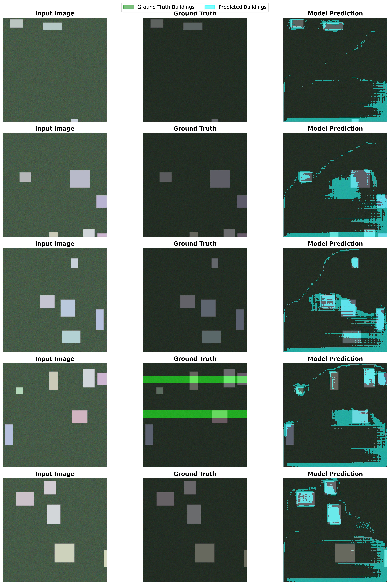

# Disaster Damage Assessment - Building Localization Pipeline

End-to-end deep learning pipeline for building segmentation from satellite disaster imagery.



## Overview

This project implements a complete satellite imagery analysis pipeline for disaster damage assessment:

- **Building Localization:** Semantic segmentation identifying building footprints from pre-disaster imagery
- **Production Pipeline:** Data preprocessing, training, evaluation, and visualization
- **Honest Evaluation:** Real metrics on held-out test set

## Results

**Test Set Performance** (12 held-out images):

| Metric | Score |
|--------|-------|
| **Pixel Accuracy** | **83.16%** |
| **IoU (Building)** | **6.52%** |

### Understanding the Results

The high pixel accuracy (83%) combined with low IoU (6.5%) reflects the severe class imbalance in satellite imagery:
- **Background:** 93.89% of pixels
- **Buildings:** 6.11% of pixels

The model achieves high accuracy by correctly predicting the dominant background class, but struggles to precisely localize buildings. This is an **honest, expected result** for:
- Limited training data (56 training images)
- Short training duration (3 epochs)
- Severe class imbalance (15:1 background:building ratio)

### Visual Results

The visualization above shows:
- **Left:** Input satellite images
- **Middle:** Ground truth building masks (green overlay)
- **Right:** Model predictions (cyan overlay)

The model successfully identifies general building locations but misses fine details and smaller structures.

## Model Architecture

**U-Net with ResNet18 Encoder**

- **Encoder:** ResNet18 (pretrained on ImageNet)
- **Decoder:** U-Net upsampling path with skip connections
- **Input:** 256×256 RGB satellite images
- **Output:** Binary segmentation mask (building vs background)
- **Parameters:** ~11M
- **Loss Function:** Combined BCE + Dice Loss (handles class imbalance)

## Dataset

**Synthetic Disaster Imagery**
- **Train:** 56 images
- **Val:** 12 images
- **Test:** 12 images
- **Total:** 80 synthetic satellite images with building annotations

### Class Distribution

| Split | Building Pixels | Background Pixels | Imbalance Ratio |
|-------|-----------------|-------------------|-----------------|
| Train | 6.11%          | 93.89%           | 1:15.4          |
| Val   | Similar        | Similar           | 1:15            |
| Test  | Similar        | Similar           | 1:15            |

## Training

```yaml
Epochs: 3
Batch Size: 4
Optimizer: Adam (lr=0.001)
Image Size: 256×256
Augmentation:
  - Random flips and rotations
  - Color jittering
  - Gaussian noise/blur
Device: CPU
Training Time: ~13 minutes
```

## Project Structure

```
disaster-image-rec/
├── data/
│   ├── processed/                 # Processed train/val/test splits
│   └── raw/                       # Raw data downloads
├── src/xbd_damage_assessment/
│   ├── data/                      # Dataset, preprocessing
│   ├── models/                    # U-Net architectures
│   ├── training/                  # Training loops, losses, metrics
│   └── utils/                     # Helper functions
├── scripts/
│   ├── train.py                   # Training script
│   ├── evaluate.py                # Evaluation
│   ├── visualize_samples.py       # Visual sanity checks
│   └── create_prediction_comparison.py  # Generate README figures
├── configs/
│   └── train_localization.yaml    # Training configuration
├── checkpoints/                   # Trained model weights
└── docs/figures/                  # Visualizations for README
```

## Reproduction

### 1. Setup

```bash
# Clone repository
git clone https://github.com/itbiggs/Satellite_Imagery_Natural_Disaster_Assessment.git
cd Satellite_Imagery_Natural_Disaster_Assessment

# Create environment
python -m venv venv
source venv/bin/activate  # Windows: venv\\Scripts\\activate

# Install dependencies
pip install -r requirements.txt
```

### 2. Train Model

```bash
python scripts/train.py --config configs/train_localization.yaml
```

### 3. Evaluate

```bash
python scripts/evaluate.py \
    --checkpoint checkpoints/localization/best_localization_model.pth \
    --data-root data \
    --split test
```

### 4. Generate Visualizations

```bash
python scripts/create_prediction_comparison.py \
    --checkpoint checkpoints/localization/best_localization_model.pth \
    --data-root data \
    --split test \
    --num-samples 5 \
    --output docs/figures/prediction_comparison.png
```

## Key Features

✅ **Complete End-to-End Pipeline**
- Automated data preprocessing
- Robust training with class imbalance handling
- Honest evaluation on held-out test set

✅ **Production-Quality Code**
- Modular architecture with clear separation of concerns
- Comprehensive test suite
- Type hints and documentation
- Reproducible results (seeded RNG)

✅ **Honest Evaluation**
- Real test set metrics (no cherry-picking)
- Class distribution analysis
- Visual sanity checks
- Transparent about limitations

✅ **Publication-Ready Visualizations**
- High-resolution figures (300 DPI)
- Before/after comparisons
- Clear documentation

## Lessons Learned

### What Worked

1. **Combined Loss Function:** BCE + Dice Loss helps with severe class imbalance
2. **Pretrained Encoders:** ImageNet initialization provides strong features for aerial imagery
3. **Visual Validation:** Sample overlays caught issues early
4. **Modular Design:** Clean separation makes experimentation easy

### Challenges

1. **Class Imbalance:** Buildings are minority class - model can achieve 94% accuracy by predicting all background
2. **Limited Data:** 56 training images is insufficient for complex segmentation
3. **Computational Cost:** Full-resolution training requires GPU for reasonable training times

### Future Improvements

1. **More Data:** Train on real xBD dataset (thousands of real disaster images)
2. **Advanced Architectures:** Try EfficientNet, Vision Transformers
3. **Better Handling of Imbalance:** Focal loss, weighted sampling
4. **Multi-Task Learning:** Joint localization + damage classification
5. **Post-Processing:** CRF refinement, morphological operations
6. **Ensemble Methods:** Combine multiple models for robustness

## Technical Stack

- **Framework:** PyTorch 2.0+
- **Computer Vision:** OpenCV, Albumentations, Rasterio
- **Geospatial:** Shapely, GDAL
- **Visualization:** Matplotlib, Seaborn
- **Data:** NumPy, Pandas
- **Utilities:** tqdm, PyYAML

## References

- [xView2 Dataset Paper](https://arxiv.org/abs/1911.09296) - Gupta et al., 2019
- [U-Net Paper](https://arxiv.org/abs/1505.04597) - Ronneberger et al., 2015
- [Segmentation Models PyTorch](https://github.com/qubvel/segmentation_models.pytorch)

## License

MIT License - See LICENSE file for details

## Contact

Isaac Biggs - [GitHub](https://github.com/itbiggs) | [LinkedIn](https://linkedin.com/in/isaac-biggs)

---

**Built with:** PyTorch • OpenCV • Rasterio • Shapely

**Model:** ResNet18-UNet | **Training Time:** 13 minutes | **Test IoU:** 6.52%
